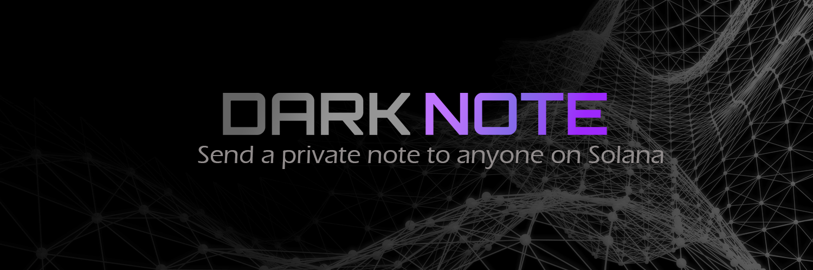

# DarkNote



Send encrypted messages to any Solana wallet. Messages are encrypted client-side and self-destruct after reading.

## What is this?

DarkNote lets you send private messages using Solana wallet addresses. The recipient is the only person who can decrypt and read the message. Even we can't read them.

## Features

- Messages encrypted before leaving your browser
- Only the recipient's wallet can decrypt
- Self-destruct after reading (optional multi-read)
- No accounts, emails, or phone numbers required
- Built with battle-tested crypto (NaCl)

## How it works

**For Recipients:**
1. Connect your Solana wallet and generate an encryption key (one-time setup)
2. Share your wallet address with people who want to send you messages

**For Senders:**
1. Enter the recipient's Solana wallet address
2. Write your message
3. Share the link with them

**Reading Messages:**
1. Click the link and connect your wallet
2. Your message decrypts in the browser
3. The message is permanently deleted from our servers

## Tech

- Next.js 15 + TypeScript
- TweetNaCl for encryption (X25519 + XSalsa20-Poly1305)
- Solana Wallet Adapter
- SQLite database

## Running locally

```bash
npm install
npm run dev
```

Visit `http://localhost:3000`

## Building

```bash
npm run build
npm start
```

## Security

Messages are encrypted with X25519 elliptic curve cryptography before leaving your browser. We store encrypted ciphertext, random nonces, and ephemeral public keys. Without your wallet's private key, decryption is mathematically impossible.

The code is open source so you can verify the encryption yourself.

## License

MIT
